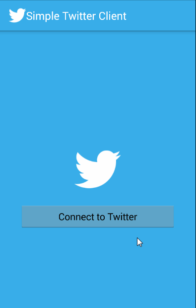

# SimpleTwitterClient
[Week 4 Project: Simple Twitter Client](http://courses.codepath.com/courses/intro_to_android/week/4#!assignment)

Time spent: 20 hours in total

Completed user stories:

 * [x] Includes all required user stories from Week 3 Twitter Client
 * [x] User can switch between Timeline and Mention views using tabs.
   * [x] User can view their home timeline tweets.
   * [x] User can view the recent mentions of their username.
 * [x] User can navigate to view their own profile
   * [x] User can see picture, tagline, # of followers, # of following, and tweets on their profile.
 * [x] User can click on the profile image in any tweet to see another user's profile.
   * [x] User can see picture, tagline, # of followers, # of following, and tweets of clicked user.
   * [x] Profile view should include that user's timeline
   * Optional: User can view following / followers list through the profile
 * [x] User can infinitely paginate any of these timelines (home, mentions, user) by scrolling to the bottom

The following advanced user stories are optional:
 * [x] Advanced: Robust error handling, check if internet is available, handle error cases, network failures
 * [x] Advanced: When a network request is sent, user sees an indeterminate progress indicator
 * [x] Advanced: User can "reply" to any tweet on their home timeline
   * [x] The user that wrote the original tweet is automatically "@" replied in compose
 * Advanced: User can click on a tweet to be taken to a "detail view" of that tweet
   * Advanced: User can take favorite (and unfavorite) or reweet actions on a tweet
 * [x] Advanced: Improve the user interface and theme the app to feel twitter branded
 * Advanced: User can search for tweets matching a particular query and see results
 * Bonus: User can view their direct messages (or send new ones)

Walkthrough of all user stories:

GIF created with [LiceCap](http://www.cockos.com/licecap/).

[Week 3 Project: Simple Twitter Client](http://courses.codepath.com/courses/intro_to_android/week/3#!assignment)

Time spent: 10 hours in total

Completed user stories:

 * [x] User can sign in to Twitter using OAuth login
 * [x] User can view the tweets from their home timeline
   * [x] User should be displayed the username, name, and body for each tweet
   * [x] User should be displayed the relative timestamp for each tweet "8m", "7h"
   * [x] User can view more tweets as they scroll with infinite pagination
   * [x] Optional: Links in tweets are clickable and will launch the web browser (see autolink)
 * [x] User can compose a new tweet
   * [x] User can click a “Compose” icon in the Action Bar on the top right
   * [x] User can then enter a new tweet and post this to twitter
   * [x] User is taken back to home timeline with new tweet visible in timeline
   * [x] Optional: User can see a counter with total number of characters left for tweet

The following advanced user stories are optional:
 
 * Advanced: User can refresh tweets timeline by pulling down to refresh (i.e pull-to-refresh)
 * [x] Advanced: User can open the twitter app offline and see last loaded tweets
   * [x] Tweets are persisted into sqlite and can be displayed from the local DB
 * Advanced: User can tap a tweet to display a "detailed" view of that tweet
 * Advanced: User can select "reply" from detail view to respond to a tweet
 * [x] Advanced: Improve the user interface and theme the app to feel "twitter branded"
 * Bonus: User can see embedded image media within the tweet detail view
 * [x] Bonus: Compose activity is replaced with a modal overlay
 
Walkthrough of all user stories:

GIF created with [LiceCap](http://www.cockos.com/licecap/).

